# Hands-on session: Setting up Microservices CI/CD pipeline based on Nexus, Jenkins and Kubernetes on AWS

##  1. Prepare for the session

### 1.1. When using local Kublr Demo Box

If you are plannig to use local Kublr Demo box, start it if not yet started.
Detailed instructions on setting up Kublr Demo and running it are
available at [https://kublr.com/demo/](https://kublr.com/demo/) and
[https://docs.kublr.com/installationguide/bootstrap/](https://docs.kublr.com/installationguide/bootstrap/).

Starting Kublr demo for the first time includes downloading a ~1Gb vagrant box
file, so it may take long time on a slow network.

After the box file is downloaded, Kublr demo virtual machine starts, which may
take up to 5 minutes.

It is recommended to install and run Kublr demo once before the session,
preferably while being connected to a fast Internet connection.

We also recommend to start Kublr Demo box before the session starts to save time.

### 1.2. When using Kublr cloud

Make sure that you have Kublr cloud URL and credentials to login.

##  2. Deploy Kubernetes cluster

1.  Open Kublr console

    Use URL [https://localhost:9443/](https://localhost:9443/) for local Kublr
    demo box.

    Use provided URL for Kublr cloud.

    <details>
        <summary>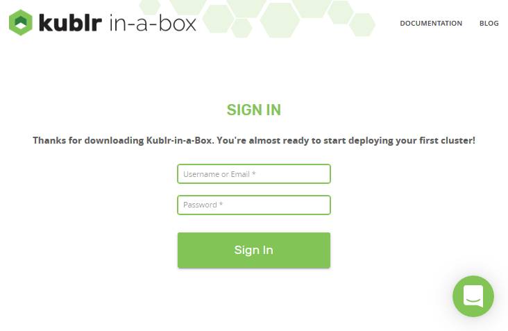</summary>
        
    </details>

2.  Login to Kublr console

    Use `admin` username and `kublrbox` password for local Kublr demo box.

    Use provided credentials for Kublr cloud.

    You will see welcome screen and empty cluster list.

    <details>
        <summary>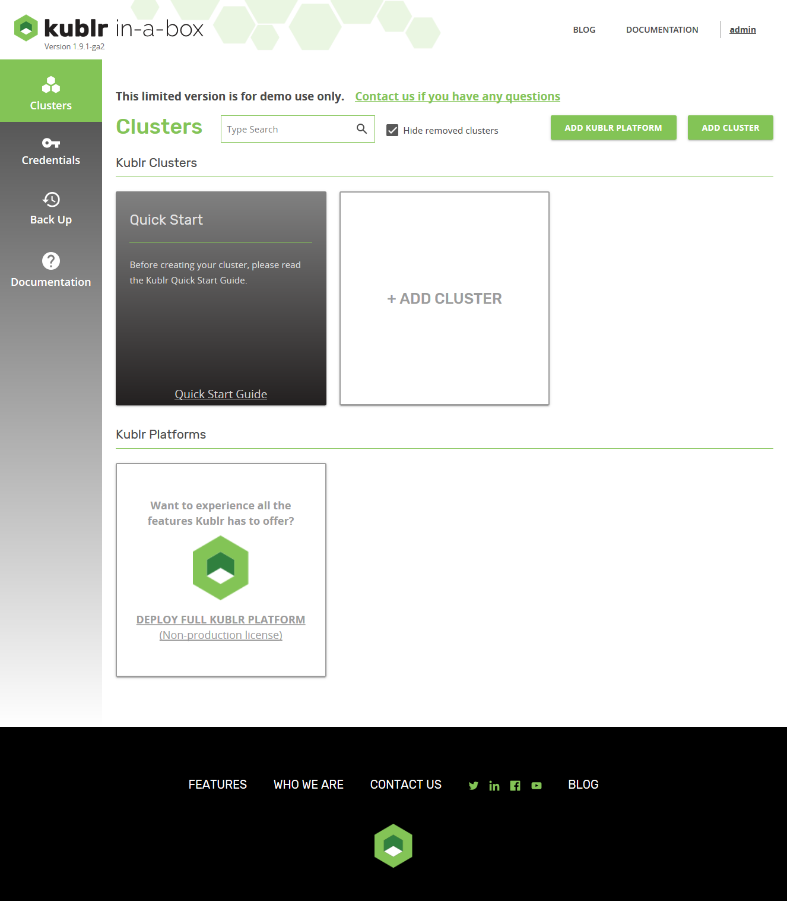</summary>
        
    </details>

3.  Go to "Credentials" page and click "Add Credentials" button to create a new
    AWS credentials entry.

    Enter `workshop-aws` in the "Name" field, your AWS access key ID in the
    "Access Key" field, and your AWS secret key in the "Secret Key" field.

    <details>
        <summary>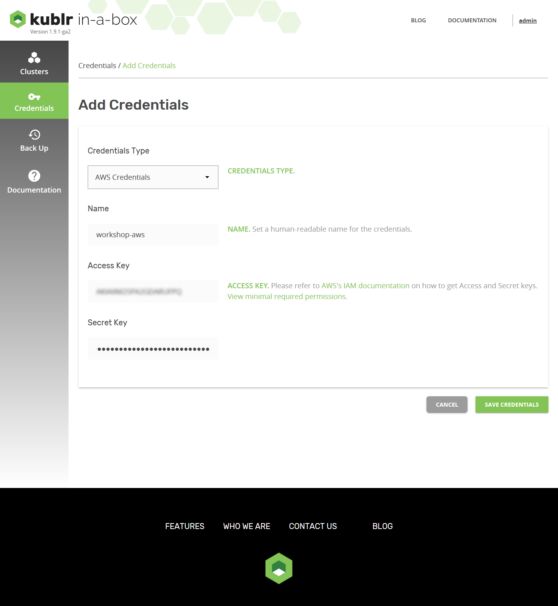</summary>
        
    </details>

4.  Go to "Clusters" page again and click "Add Cluster" button.

    This will start cluster creation wizard.

    Enter or select the following values in the form

    *   Provider: Amazon Web Services

    *   Cluster Name: leave generated cluster name unchanged to make sure that
        it does not clash with other workshop participants.

    *   Select Region: `us-east-1`

    *   Credentials: `workshop-aws`

    *   Masters: 1

    *   Instance Type: `t2.medium`

    *   Nodes: 2

    *   Instance Type: `t2.large`

    *   In "Monitoring" section click `Add monitoring` and select `Self-hosted
        Prometheus / Grafana`

        Leave default settings in the form that appears as is.

    The completed form will look as follows:

    <details>
        <summary>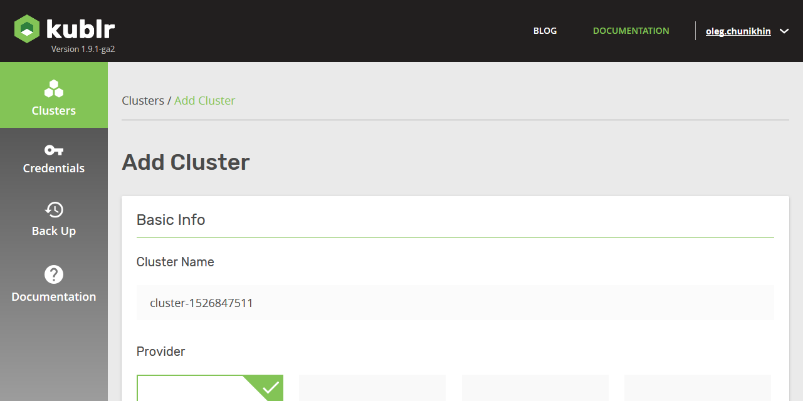</summary>
        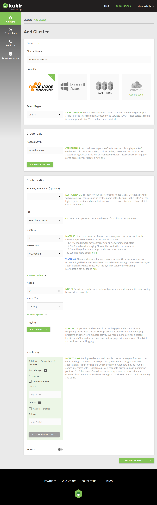
    </details>

    Click "Confirm and Install" button to start creation of a new cluster.

Cluster creation usually takes 10-20 minutes. You can track progress of this
process via cluster overview, status, and events pages:

<details style="display:inline;">
    <summary>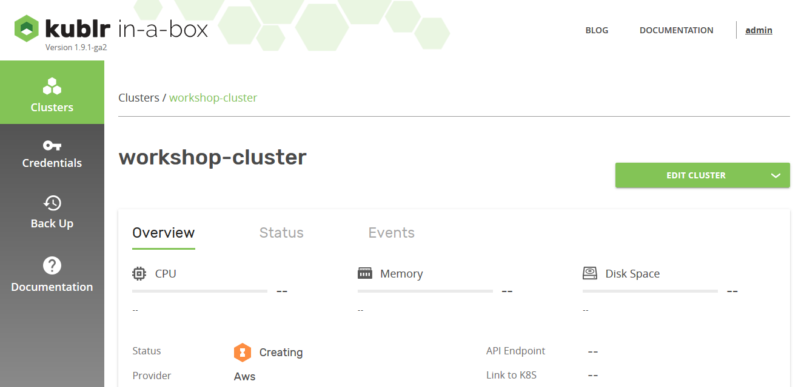</summary>
    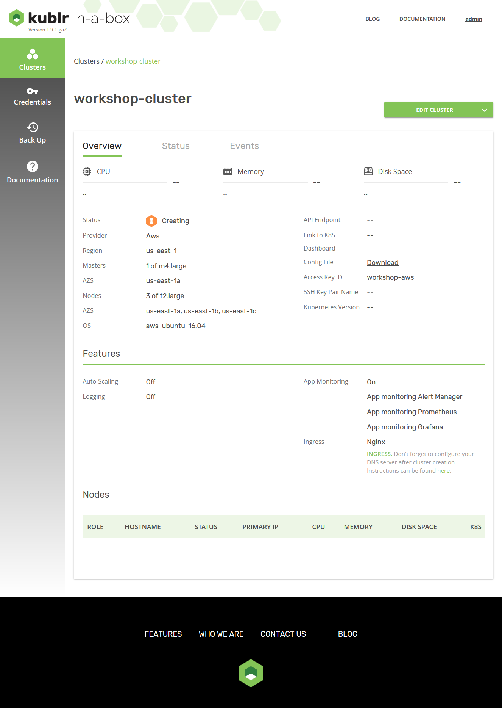
</details>
<details style="display:inline;">
    <summary>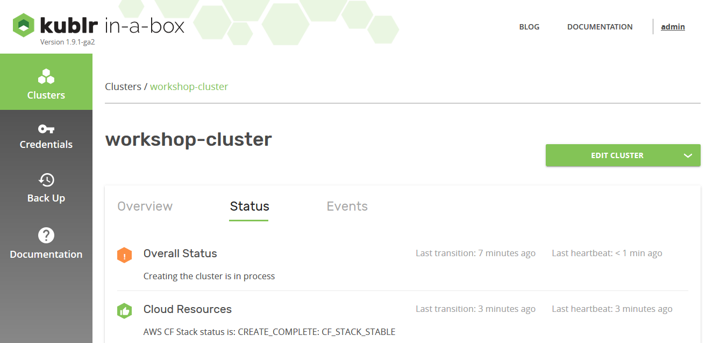</summary>
    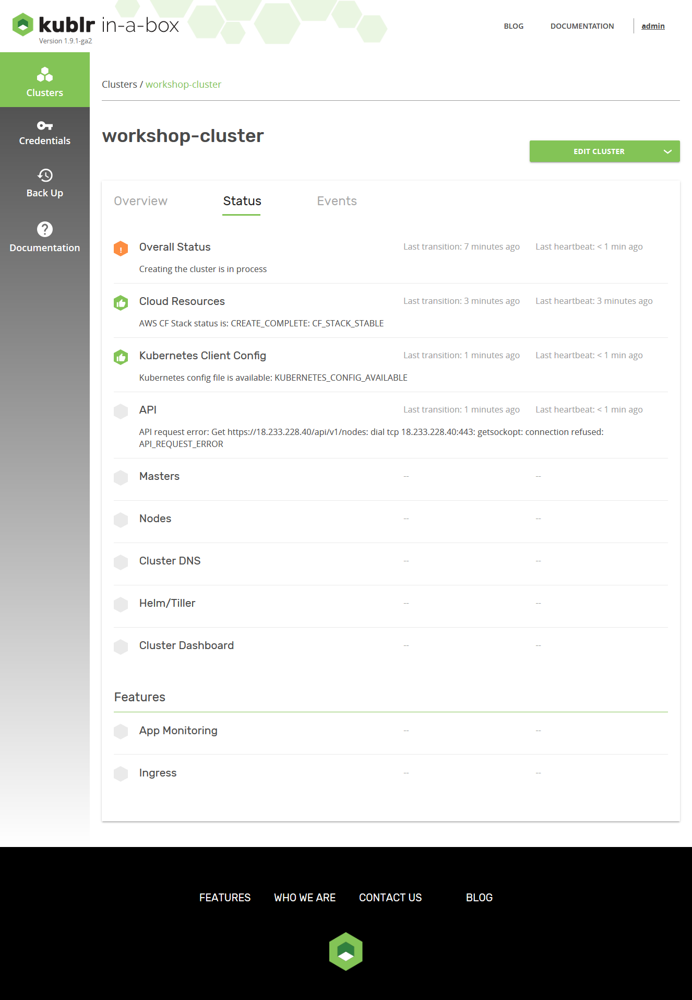
</details>
<details style="display:inline;">
    <summary>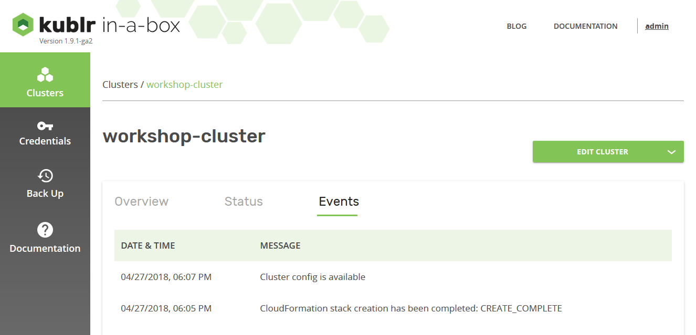</summary>
    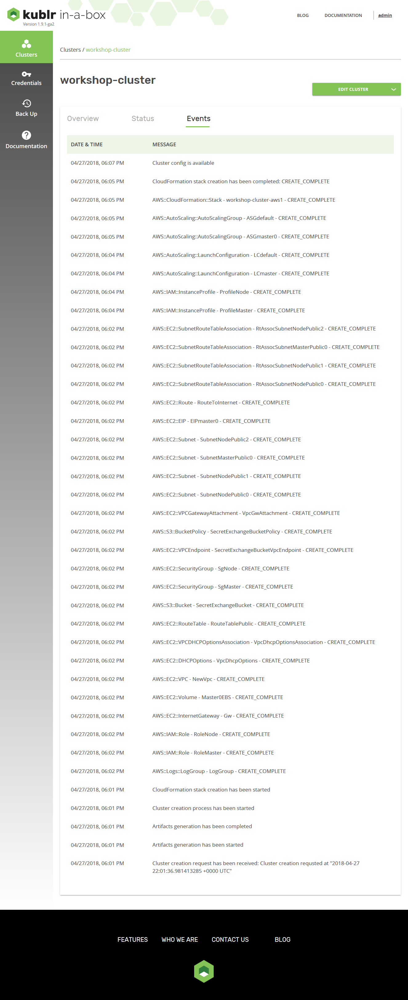
</details>

### 2.1. Get cluster config for admin access

After cluster creation is complete, download kubernetes config file from the
cluster overview screen and copy it to `~/.kube/config`

Verify that now Kubernetes client is configured properly by running the
following command:

```
kubectl get nodes
```

You should be able to see 3 nodes - one master and 2 worker node.

### 2.2. Accessing Kubernetes cluster API

Make a note of K8s cluster API endpoint address and admin credentials (login and
password) from the cluster config file `~/.kube/config`.

The config file is in yaml format; the endpoint may be found in the section
`clusters[name='cluster-1526561920'].server` and credentials are in the sections
`users[name='cluster-1526561920-admin-basic-auth'].user`

Kubernetes cluster API may be checked in a browser on https API endpoint: we
will use `https://18.233.228.40` for the purposes of this document, although
each cluster will have their own address.

You will also have to accept self-signed certificate in the browser and provide
admin credentials to access the API in a browser.

### 2.3. Accessing Kubernetes dashboard

Kubernetes dashboard may be accessed via this address at the following URL:
`https://18.233.228.40/api/v1/namespaces/kube-system/services/https:kubernetes-dashboard:/proxy/`

### 2.4. Self-hosted Prometheus / Grafana monitoring

Prometheus is availabe at
`https://18.233.228.40/api/v1/namespaces/kube-system/services/app-monitoring-prometheus/proxy/`

Grafana is availabe at
`https://18.233.228.40/api/v1/namespaces/kube-system/services/app-monitoring-grafana/proxy/`

In addition to Kubernetes authentication, Grafana itself asks for login.

Default Grafana administrator credentials may be found in Kubernetes secret
`app-monitoring-grafana` in `kube-system` namespace.

Normally username is `admin`.

Password may be looked up via Kubernetes dashboard, or using the following
command line:

```
kubectl get secrets \
  -n kube-system app-monitoring-grafana \
  -o 'jsonpath={.data.grafana-admin-password}' \
  | base64 --decode
```

##  3. Clone the main workshop project sources

Create and go to your work directory and clone workshop project sources from
GitHub.

```
mkdir ~/workshop
git clone https://github.com/kublr/workshop-microservice-build-pipeline.git
```

##  4.  Common objects in K8S cluster

CD to the `workshop-microservice-build-pipeline` project directory

```
cd ~/workshop/workshop-microservice-build-pipeline
```

### 4.1. Create AWS Access Key secret for AWS EFS provisioner

AWS EFS provisioner is an addon Kubernetes component that enables dynamic
allocation of AWS EFS volumes in Kubernetes clusters. We will use it to
provision EFS volume where Nexus and Jenkins data is stored, but it can also
be used for dynamic volume management for other applications data.

For the provisioner to work it needs to have access to AWS API, so the first
step is to register a Kubernetes Secret metadata object containing AWS access
and secret keys.

Replace AWS access and secret keys in the following command and execute it:

```
kubectl create secret generic \
  -n kube-system \
  aws-efs-provisioner \
  '--from-literal=AWS_ACCESS_KEY_ID=***' \
  '--from-literal=AWS_SECRET_ACCESS_KEY=***'
```

### 4.2. Deploy the provisioner and storage class

The following command will deploy the provisioner and corresponding storage
class.

```
kubectl apply -f build/efs/efs-provisioner-and-storage-class.yaml
```

### 4.3. Create `build` namespace

Next, we will create `build` namespace and a persistent volume claim in that
namespace that binds to the persistent volume.

Pods cannot work with persistent volumes (non-namespaced objects) directly,
they can only work with them through persistent volume claims in the same
namespace, bound to a persistent volume.

Run the following commands to create `build` namespace

```
kubectl create namespace build
```

### 4.4. Provision EFS volume

As we are using dynamic provisioning, we will only need to create a
persistent volume claim to get a new EFS volume; the rest will be taken care of
by the provisioner.

```
kubectl apply -f build/efs/efs-pvc.yaml
```

It takes about 3 minutes to complete provisioning of a EFS file system.

You can check that the persistent volume claim is created and bound via
Kubernetes dashboard or CLI `kubectl` utility:

```
kubectl get pvc -n build
```

Expected result:

```
NAME      STATUS    VOLUME        CAPACITY   ACCESS MODES   STORAGECLASS   AGE
efs       Bound     fs-8fb60ec7   8E         RWX            aws-efs-gp     3m
```

##  5. Nexus docker repository deployment and configuration

### 5.1. Deploy Nexus in K8S cluster

Deploy Nexus deployment and service objects:

```
kubectl apply -f build/nexus/nexus-deployment.yaml
kubectl apply -f build/nexus/nexus-service.yaml
```

It may take a minute or two for Nexus to start and complete initialization.

Nexus UI will be available at `http://18.233.228.40:30081/` due to Nexus
Service node port configuration.

<details>
    <summary>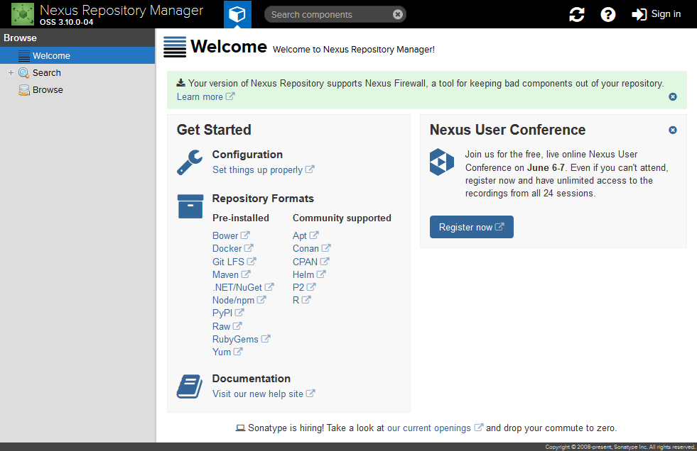</summary>
    
</details>

### 5.2. Configure docker registry in Nexus

Login ("Sign In" button in the top right corner) using initial administrator
credentials - username `admin` and password `admin123`.

Create a hosted docker repository:

1.  Go to "Server administration and configuration" screen (cog button at the
    top)

2.  Open "Repositories" screen

    <details>
        <summary>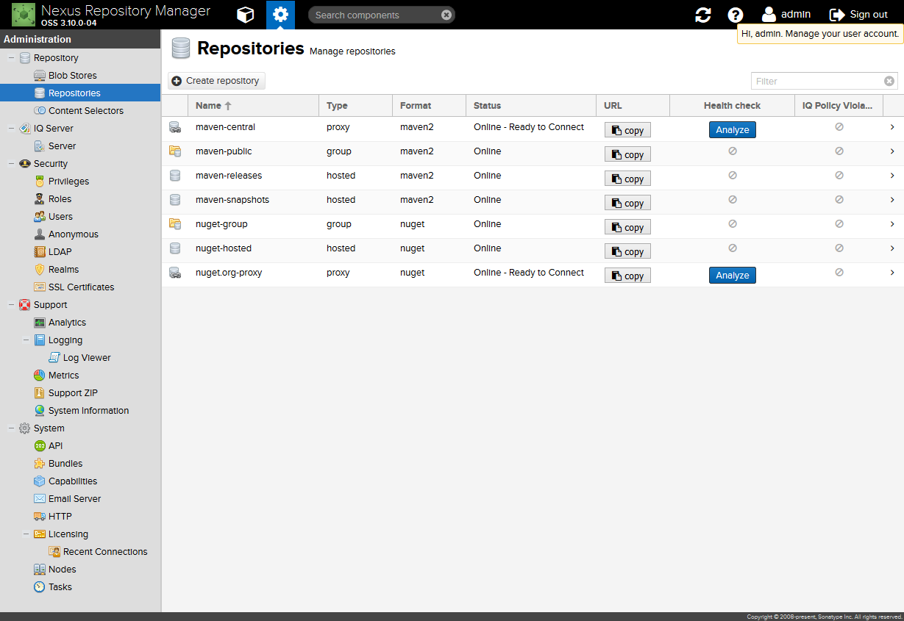</summary>
        
    </details>

3.  Click "Create repository" button and select "docker (hosted)" repository type; fill the form with the following values:

    *  Name: docker0

    *  HTTP port: 5000

    <details>
        <summary></summary>
        
    </details>

    and click "Create repository" button.

##  6. Jenkins CI server deployment and configuration

### 6.1. Deploy Jenkins to K8S cluster

Deploy Jenkins deployment and service objects:

```
kubectl apply -f build/jenkins/jenkins-deployment.yaml
kubectl apply -f build/jenkins/jenkins-service.yaml
```

Open Jenkins UI at `http://18.233.228.40:30080/`

<details>
    <summary>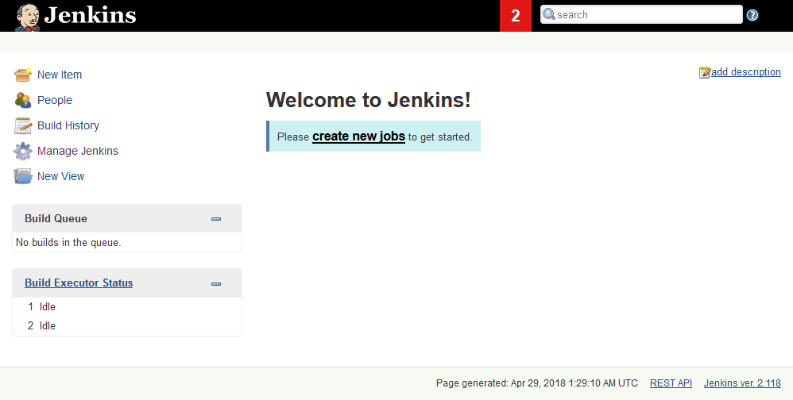</summary>
    
</details>

### 6.2. Install required Jenkins plugins:

1.  Go to "Manage Jenkins" > "Manage Plugins" > "Available" screen

2.  select the following plugins

    *   Kubernetes

    *   Pipeline

    *   Pipeline: Multibranch

    *   Timestamper

    *   Git

3.  Click "Download now and install after restart"

4.  In the next screen check ckeckbox labeled "Restart Jenkins when installation is
    complete and no jobs are running"

Plugin download, installation, and following Jenkins restart may take up to 5 minutes.

### 6.3. Setup Jenkins to run dynamically allocated workers as pods in K8S cluster

Set number of master-based executors to 0:

1.  Go to "Build Executor Status" > "Configure" (on "master")

2.  Set `# of executors` to 0

3.  Set `Usage` to `Only build jobs with label expressions matching this node`

4.  Set `Labels` to `master`

    <details>
        <summary>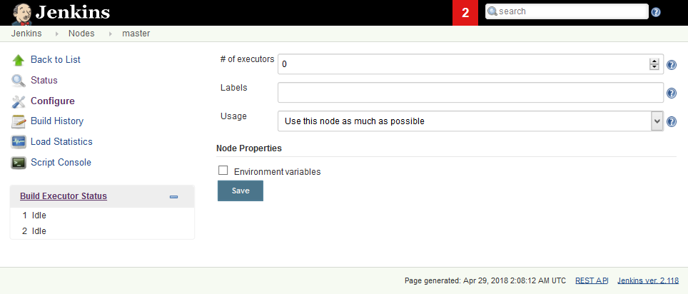</summary>
        
    </details>

3.  Click "Save" button

Configure Jenkins "Kubernetes cloud"

1.  Go to "Manage Jenkins" > "Configure System" > "Add a new cloud" > "Kubernetes"

2.  Fill in the following values in the form:

    *   Kubernetes URL: https://kubernetes.default.svc.cluster.local

    *   Kubernetes Namespace: `default`

    *   Jenkins URL: http://jenkins.build.svc.cluster.local:8080

    <details>
        <summary>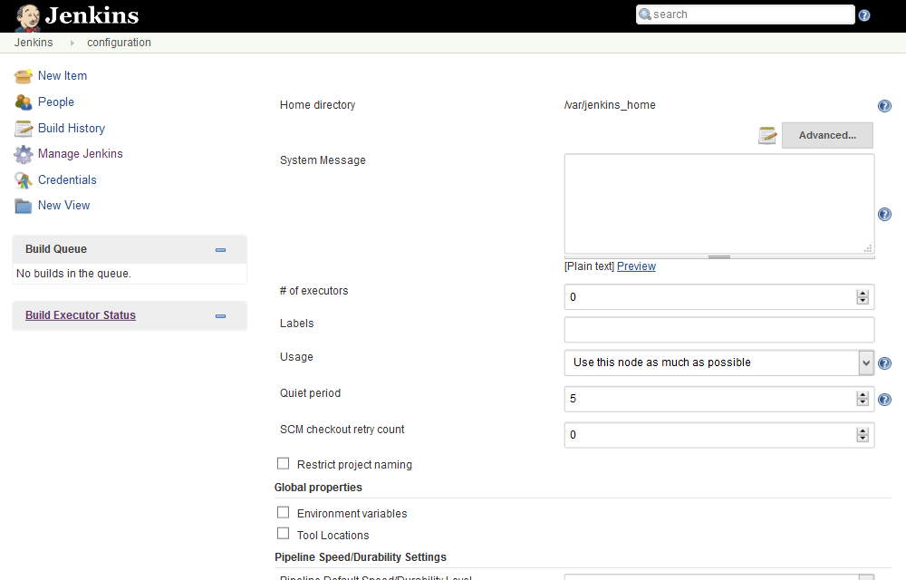</summary>
        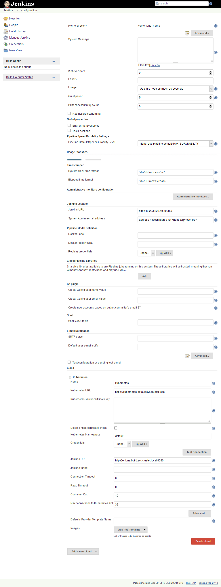
    </details>

3.  Click "Save" button

##  7. Setup CI for microservices projects on Jenkins and Kubernetes

Istio is a microservices framework and platform that runs on Kubernetes and
solves a number of generic problems related to microservices: traffic routing,
TLS, authentication and authorizations, traceability, load balancing, various
microservices patterns, ingress routing etc.

### 7.1. Setting up Istio microservices platform

#### 7.1.1. Deploy Istio to K8S cluster

Make sure that Istio 0.7.1 is downloaded and unpacked from
https://github.com/istio/istio/releases/tag/0.7.1

For the purposes of this session we will use `~/Programs/istio-0.7.1` as istio
unpacked directory.

Installing Istio is straightforward:

```
kubectl apply -f ~/Programs/istio-0.7.1/install/kubernetes/istio.yaml
```

Note that sometimes some custom resources are not created (errors printed), in
which case just run the same command again to complete their creation.

Verify installation with the following commands

```
kubectl get svc -n istio-system
kubectl get pods -n istio-system
```

For more details see Istio documentation at
https://istio.io/docs/setup/kubernetes/quick-start.html#installation-steps

#### 7.1.2. Expose Istio monitoring endpoints to Prometheus

Run

```
kubectl apply -f microservices/monitoring.yaml
```

#### 7.1.3. Deploy Jaeger to K8S cluster

Jaeger is microservices tracing framework.

```
kubectl apply -n istio-system -f https://raw.githubusercontent.com/jaegertracing/jaeger-kubernetes/master/all-in-one/jaeger-all-in-one-template.yml

```

See https://istio.io/docs/tasks/telemetry/distributed-tracing.html for more
details.

After Jaeger is deployed, it can be accessed through Kubernetes proxy API at
https://18.233.228.40/api/v1/namespaces/istio-system/services/jaeger-query:80/proxy/

#### 7.1.4. Make note of Istio ingress endpoint

Istio set up its own ingress controller with a cloud specific load balancer.
Use the following command to find Istio ingress controller endpoint:

```
kubectl get service -n istio-system istio-ingress -o 'jsonpath={.status.loadBalancer.ingress[0].hostname}'
```

This will print Load Balancer address such as
`af917ccdb5be011e881220ae826d3a5a-1158974335.us-east-1.elb.amazonaws.com`

We will use this address for the purposes of this document, replace it with
your specific address when running corresponding commands below.

#### 7.1.5. Import Grafana dashboards for Istio

In Grafana UI import dashboards from files `microservices/istio-dashboard.json`,
`microservices/mixer-dashboard.json`, and
`microservices/istio-dashboard-demo-app.json`

### 7.2. Fork and clone demo application GitHub projects

1.  Open https://github.com/kublr/workshop-microservice-build-pipeline-colorer

2.  Fork the project into your GitHub account. For the purposes of this document I will
    use the project forked to my account `olegch` at
    https://github.com/olegch/workshop-microservice-build-pipeline-colorer

3.  Go to your work directory and clone the project

    ```
    cd ~/workshop
    git clone git@github.com:olegch/workshop-microservice-build-pipeline-colorer.git
    ```

Repeat the same operation for projects
https://github.com/kublr/workshop-microservice-build-pipeline-aggregator and
https://github.com/kublr/workshop-microservice-build-pipeline-webui

### 7.3. Configure Jenkins secrets/credential for the job

1.  In Jenkins UI go to "Credentials" > "System" >
    "Global credentials (unrestricted)" > "Add Credentials"

    -   Kind: `Username with password`

    -   Scope: `Global`

    -   Username: `admin`

    -   Password: `admin123`

    -   ID: `docker-registry`

    <details>
        <summary>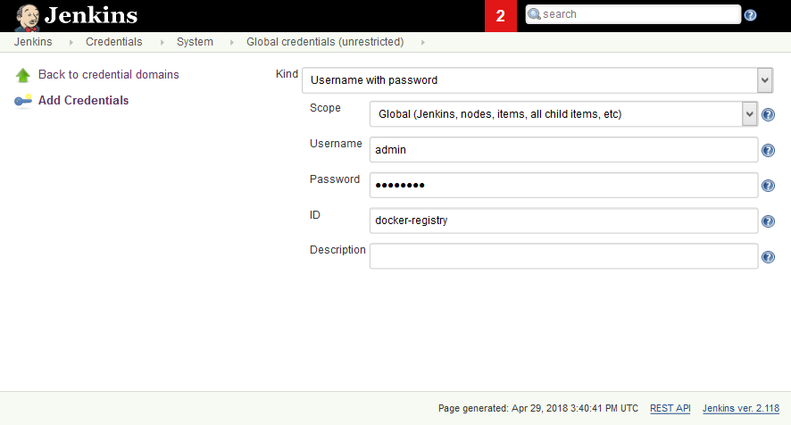</summary>
        
    </details>

    Click "Ok" button

2.  In Jenkins UI go to "Credentials" > "System" >
    "Global credentials (unrestricted)" > "Add Credentials"

    -   Kind: `Secret file`

    -   Scope: `Global`

    -   upload config.yaml for the cluster

    -   ID: `k8s-config`

    <details>
        <summary>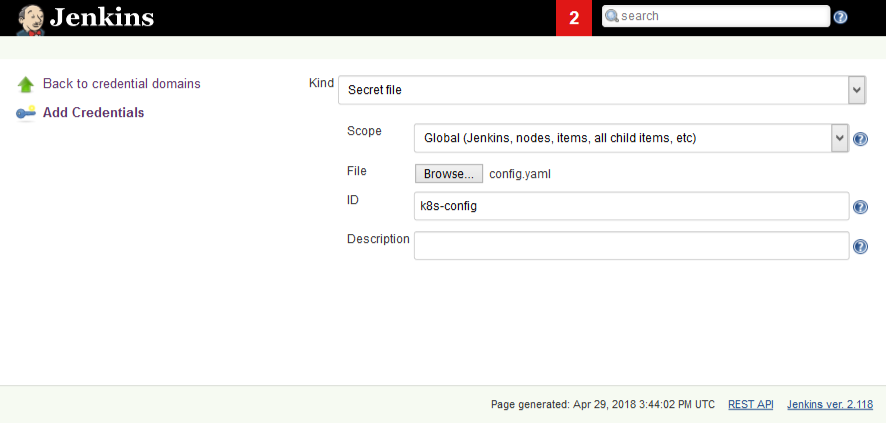</summary>
        
    </details>

    Click "Ok" button

### 7.4. Create and run CI jobs

1.  In Jenkins UI click "New Item" and specify the job type and name:

    *   Name: colorer

    *   Type: Multibranch Pipeline

    <details>
        <summary>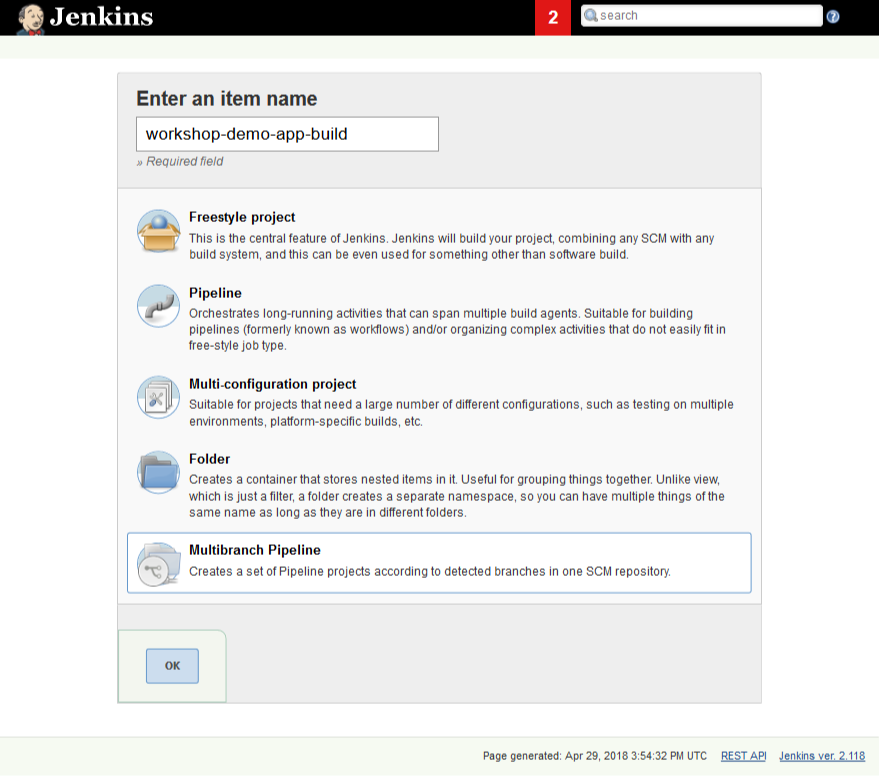</summary>
        
    </details>

    Click "Ok" button

2.  Fill in the job configuration wizard form

    *   In "Branch Sources" section click "Add source" > "Git"

        *   Project Repository:
            https://github.com/olegch/workshop-microservice-build-pipeline-colorer.git
            (note `https` protocol to ensure that the public GitHub project can
            be cloned by Jenkins without a need to provide credentials)

            *   in "Behaviors" click "Add" > "Filter by name (with wildcards)"

                *   Include: `*`

            *   In "Behaviors" click "Add" > "Check out to matching local branch"

    *   In "Scan Multibranch Pipeline Triggers"

        *   Check "Periodically if not otherwise run"

        *   Set interval to "1 minute"

    <details>
        <summary>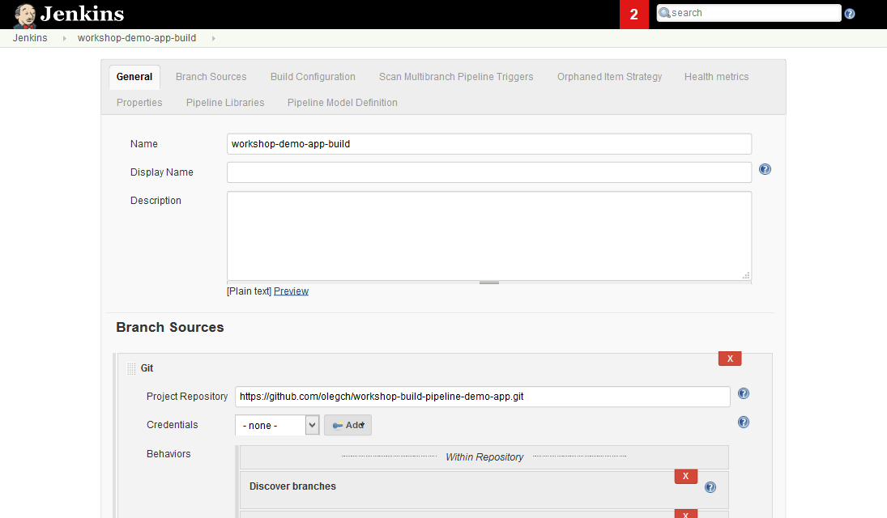</summary>
        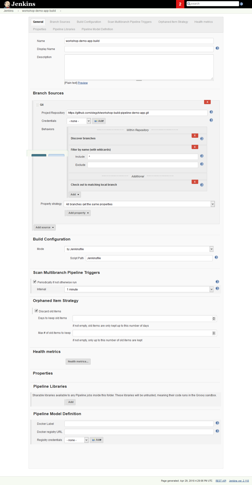
    </details>

3.  Click "Save" and watch the first scan, build and deployment of the project.

Repeat the same actions to create `aggregator` and `webui` build jobs for
projects
https://github.com/olegch/workshop-microservice-build-pipeline-aggregator.git
and
https://github.com/olegch/workshop-microservice-build-pipeline-webui.git
correspondingly.

After the first build on the `master` branches successfully completes, the
application UI will be accessible through Kubernetes API at
https://18.233.228.40/api/v1/namespaces/master/services/webui:8080/proxy/

It will also be accessible through Istio ingress controller endpoint at
http://af917ccdb5be011e881220ae826d3a5a-1158974335.us-east-1.elb.amazonaws.com/webui-master/

## 8. Test applications and application updates

### 8.1. Run constant test load

Run from command line (make sure to replace `--server` parameter with the
correct Istio ingress controller endpoint):

```
docker run dos65/httperf httperf \
  --server=af917ccdb5be011e881220ae826d3a5a-1158974335.us-east-1.elb.amazonaws.com \
  --uri=/webui-master/ \
  --rate=10 \
  --num-calls=1000000
```

Or edit `microservices/test-load-pod.yaml` for correct Istio endpoint and deploy
it to Kubernetes cluster:

```
kubectl apply -f microservices/test-load-pod.yaml
```

Review load in Grafana dashboards.

### 8.2. Modify `colorer` microservice

Modify application code in a feature branch and test it after automatic build
and deploy

1.  Create a feature branch in the `colorer` component

    ```
    cd ~/workshop/workshop-microservice-build-pipeline-colorer
    git checkout -b feature/demo
    ```

2.  Edit application code

    ```
    vim pkg/colorer/colorer-handler.go
    ````

3.  Commit and push changes

    ```
    git commit -a -m "Code updated"
    git push origin feature/demo
    ```

4.  Wait for a minute or initiate manual git rescan in the Jenkins build job

5.  After build and deployment process is complete, updated microservice
    `colorer` is deployed in `featuredemo` namespace and can be tested via
    Kubernetes API at
    https://18.233.228.40/api/v1/namespaces/featuredemo/services/webui:8080/proxy/

### 8.3. Route some of the traffic to the updated version of the service

To route 10% of the traffic to a new version of `colorer`, create a routing
rule in `master` namespace.

```
kubectl apply -n master -f microservices/route-rule-canary-10.yaml
```

Review changed response characteristics in Grafana dashboards.
